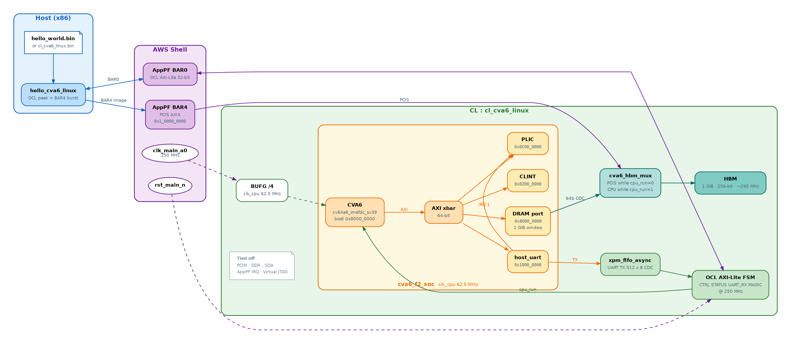
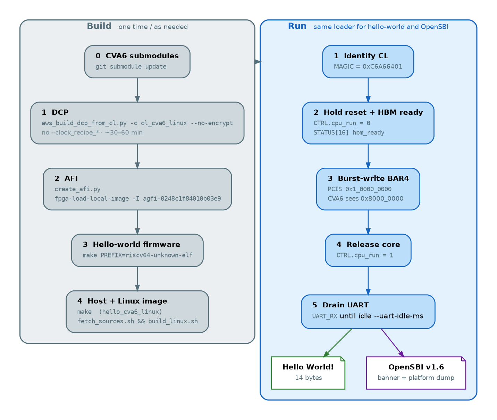
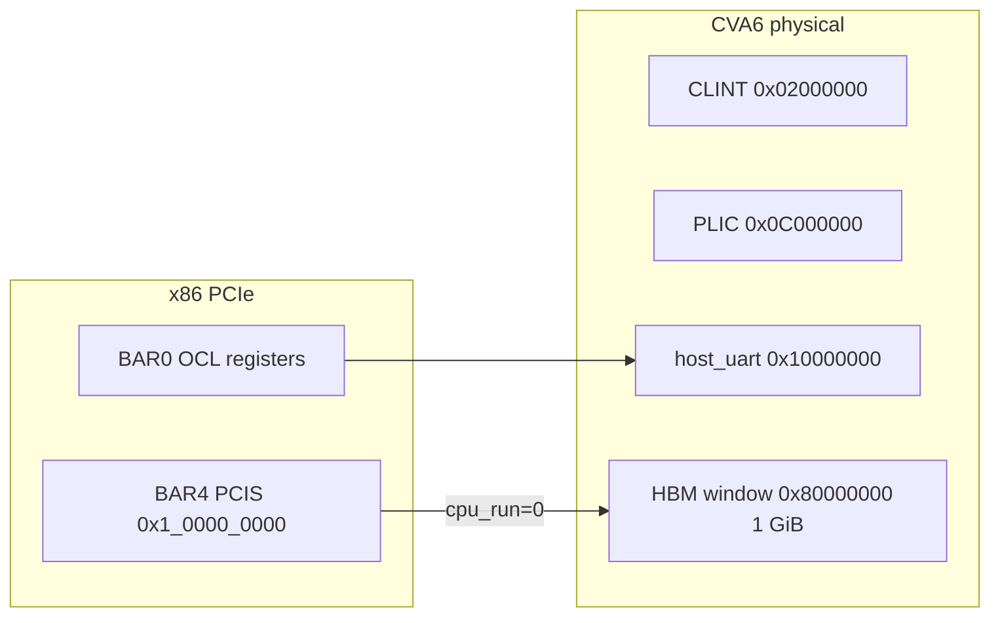
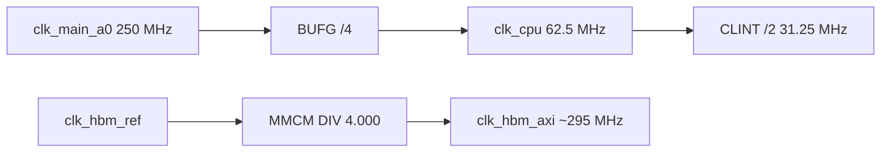

# CL_CVA6_LINUX — 64-bit Linux-capable CVA6 on AWS F2

Sibling of [`cl_cva6`](../cl_cva6/README.md). Same OCL poke/peek bring-up, with **`TARGET_CFG=cv64a6_imafdc_sv39`** (RV64IMAFDC, Sv39, S/U) instead of the 32-bit FPGA config.

This file is the handbook for the CL: architecture, F2 infrastructure, memory and register maps, every command used in bring-up, issues already fixed, and what is still open.

**NeuQore F2 stack:** HDK [NeuQore/aws-fpga](https://github.com/NeuQore/aws-fpga) branch **`cva6`**, CVA6 [NeuQore/cva6](https://github.com/NeuQore/cva6) branch **`f2-cva6`**, firmware siblings `linux` / `opensbi` / `busybox` @ **`cva6`** (see [`linux/sources.env.sh`](linux/sources.env.sh)). Overview of all CL examples and AGFIs: [CVA6_F2_README.md](../CVA6_F2_README.md).

## Status (read this first)

| Path | State |
|------|--------|
| Timing-clean DCP | **Done.** `build/checkpoints/cl_cva6_linux.2026_08_27-103543.post_route.dcp` |
| AFI on F2 `us-east-1` | **Loaded.** AFI `afi-06a08d518aae438a1` / AGFI `agfi-0248c1f84010b03e9` |
| RV64 hello-world via **HBM + AppPF BAR4** | **Pass.** MAGIC `0xC6A66401`, `"Hello World!\r\n"` (14 UART bytes) |
| Linux **hardware** (CLINT, PLIC, UART IRQ, 1 GiB DRAM window) | In the SoC |
| Linux **software** (DTS, OpenSBI v1.6, Linux v6.12, BusyBox 1.37.0) | **Builds** → `linux/out/cl_cva6_linux.bin` (~28 MiB) |
| OpenSBI **prints on F2** | **Pass.** Banner `OpenSBI v1.6`, platform/domain dump (~2500 UART bytes) |
| Linux **kernel / BusyBox shell** | **Not yet.** OpenSBI next stage is S-mode `0x80200000`. Late UART is lossy. |

Host load remap: CVA6 physical `0x80000000` is PCIS/BAR4 offset **`0x0010_0000_0000`**. Do **not** use XDMA / `fpga_dma`. F2 has no XDMA.

## Table of Contents

1. [Diagrams](#diagrams)
2. [Infrastructure](#infrastructure)
3. [Architecture](#architecture)
4. [Clocks, reset, and CDC](#clocks-reset-and-cdc)
5. [HBM and address remap](#hbm-and-address-remap)
6. [CVA6 memory map](#cva6-memory-map)
7. [OCL register map](#ocl-register-map)
8. [PCIe / Shell IDs](#pcie--shell-ids)
9. [Repository layout](#repository-layout)
10. [What changed vs cl_cva6](#what-changed-vs-cl-cva6)
11. [Overview (ISA table)](#overview-isa-table)
12. [Top-level block diagram](#top-level-block-diagram)
13. [Flow](#flow)
14. [Complete command flow](#complete-command-flow)
15. [Software stacks](#software-stacks)
16. [Issues fixed](#issues-fixed)
17. [Timing closure](#timing-closure)
18. [OpenSBI on F2](#opensbi-on-f2)
19. [Next steps](#next-steps)

## Diagrams

Rendered PNGs live in `docs/` (sources are the matching `.dot` files). If a preview does not show the images, open the PNG paths below in the editor.

### Block diagram — host, Shell, CL, SoC, HBM



### Build and run flow



```bash
cd $CL_DIR/docs
dot -Tpng -Gdpi=140 cl_cva6_linux_block_diagram.dot -o cl_cva6_linux_block_diagram.png
dot -Tpng -Gdpi=140 cl_cva6_linux_boot_flow.dot     -o cl_cva6_linux_boot_flow.png
```

### Memory map



### Clocks



---

## Infrastructure

### Machine and tools

| Item | This bring-up |
|------|----------------|
| Host | Ubuntu 24.04, F2 instance, `us-east-1` |
| FPGA | AWS F2, slot 0 |
| HDK | `$AWS_FPGA_REPO_DIR` = `/projects/prj1/sle-wajahat/aws-fpga` |
| CVA6 | `$CVA6_REPO_DIR` = `/projects/prj1/sle-wajahat/cva6` |
| CL | `$CL_DIR` = `$AWS_FPGA_REPO_DIR/hdk/cl/examples/cl_cva6_linux` |
| Vivado | 2025.2 (HDK `hdk_setup.sh`) |
| SDK | `$AWS_FPGA_REPO_DIR/sdk` after `source sdk_setup.sh` |
| Long jobs | **tmux** session (`tmux attach -t 0`). Closing the IDE must not kill Vivado or FPGA boots. |
| `sudo` | FPGA tools and BAR mmap need root. A non-tmux agent shell often has no sudo ticket; run `fpga-*` and `hello_cva6_linux` in tmux. |

### Environment (export before any HDK/SDK command)

```bash
export AWS_FPGA_REPO_DIR=/projects/prj1/sle-wajahat/aws-fpga
export CVA6_REPO_DIR=/projects/prj1/sle-wajahat/cva6
export CL_DIR=$AWS_FPGA_REPO_DIR/hdk/cl/examples/cl_cva6_linux
export TARGET_CFG=cv64a6_imafdc_sv39
export AWS_DEFAULT_REGION=us-east-1
export AWS_REGION=us-east-1
```

`CL_DIR` must point at **`cl_cva6_linux`** *before* `source hdk_setup.sh`. `source sdk_setup.sh` from `$AWS_FPGA_REPO_DIR`, not from a nested directory (a wrong `PWD` rewrites `AWS_FPGA_REPO_DIR`).

```bash
cd $AWS_FPGA_REPO_DIR
set --                    # hdk_setup.sh consumes leftover argv
source hdk_setup.sh
source sdk_setup.sh       # sets SDK_DIR
```

### F2 / AFI

| | ID |
|--|----|
| Region | `us-east-1` |
| AFI | `afi-06a08d518aae438a1` |
| AGFI | `agfi-0248c1f84010b03e9` |
| Slot | 0 |
| `create_afi.py` | `$AWS_FPGA_REPO_DIR/hdk/scripts/create_afi.py` |
| F2 region fallback | `KNOWN_F2_REGIONS` = `us-east-1`, `us-west-2`, `ap-southeast-2`, `eu-west-2` if discovery is empty |
| Region cache | `~/.aws/fpga_regions_cache.json` |

Shell interfaces this CL uses: **OCL (AppPF BAR0)** and **PCIS (AppPF BAR4)**. Tied off: PCIM, DDR (`EN_DDR=0`), SDA, AppPF IRQ, Virtual JTAG, DMA-full flags. HBM is on (`EN_HBM=1`). There is **no** `AWS_CLK_GEN` in this CL.

Do **not** pass `--clock_recipe_*` on `aws_build_dcp_from_cl.py` unless you also pass `--aws_clk_gen`. H2 is already the Python default and does **not** retune the real HBM AXI MMCM.

### Cross compilers

| Job | Compiler |
|-----|----------|
| Hello-world firmware | `riscv64-unknown-elf-gcc` (`-march=rv64imafdc_zicsr -mabi=lp64d`) |
| OpenSBI, Linux, BusyBox | `riscv64-linux-gnu-gcc` |
| Host loader | `gcc` + `-lfpga_mgmt` |

```bash
sudo apt-get install -y \
  gcc-riscv64-unknown-elf gcc-riscv64-linux-gnu device-tree-compiler \
  build-essential bc bison flex libssl-dev libelf-dev
```

---

## Architecture

The full picture is in [Diagrams](#diagrams). Layers in text:

```text
 x86 host
   hello_cva6_linux
        |  AppPF BAR0  AXI-Lite 32-bit   (OCL: MAGIC, CTRL, UART drain)
        |  AppPF BAR4  AXI4 PCIS         (image burst into HBM)
        v
 AWS Shell  (clk_main_a0 250 MHz, rst_main_n, HBM wrapper, PCIS)
        v
 cl_cva6_linux.sv
   OCL AXI-Lite FSM
   clk_cpu = clk_main_a0 / 4  (62.5 MHz, BUFG)
   xpm_fifo_async  (UART TX capture, 512 x 8)
   cva6_hbm_mux    (PCIS vs CPU ownership of one HBM AXI port)
   cva6_axi_clock_converter  (64-bit @ clk_cpu  ↔  256-bit HBM)
   cl_hbm_axi4 / cl_hbm_wrapper  (1× 256-bit AXI, ~295 MHz)
   cva6_f2_soc @ clk_cpu
        cv64a6_imafdc_sv39
        AXI xbar → DRAM, host_uart, CLINT, PLIC
```

### `cva6_f2_soc`

Single-hart SoC. Core reset is `rst_ni & cpu_run_i` (host holds the core until the image is in HBM).

| Master / slave | Role |
|----------------|------|
| CVA6 AXI 64-bit | Sole xbar slave |
| DRAM (idx 0) | 1 GiB window at `0x80000000`, exported as `dram_axi` |
| UART (idx 1) | `host_uart` APB via AXI-to-APB |
| CLINT (idx 2) | `0x02000000`, `mtime` toggled at `clk_cpu/2` |
| PLIC (idx 3) | `0x0C000000`, UART = source 1 |

Config overrides on stock `cv64a6_imafdc_sv39`: `FpgaEn=1`, `CvxifEn=0`, cached/execute DRAM length = `DramBytes` (1 GiB). I$ 16 KiB, D$ 32 KiB, 2 commit ports, FPU on (`core/cvfpu`).

### `host_uart`

Synthesizable 16550-like APB UART. Register index is `(paddr >> 2) & 7` (`reg-shift=2`). TX bytes go `tx_valid`/`tx_data` into the host async FIFO. LSR.THRE/TEMT follow `tx_ready && !tx_valid`. THRE IRQ is `IER[1]` (PLIC source 1). There is **no RX from the host**; console is output-only. The APB TX holding register is **one byte**; stores that do not wait for THRE can overwrite a byte the FIFO has not accepted.

Hello-world firmware uses **byte** accesses (`UART_LINE_STATUS = BASE+20`). OpenSBI 8250 uses DTS `reg-io-width = <4>` (`readl`/`writel`); the APB slave returns the byte in `[7:0]` of a 32-bit read.

### `cva6_hbm_mux`

One HBM AXI port, two masters. **PCIS owns HBM while `cpu_run=0`.** Ownership flips only when no outstanding reads/writes, so responses cannot go to the wrong master. Inactive master is backpressured (not silently dropped).

Address strip:

| Master | Address in | Address to HBM |
|--------|------------|----------------|
| CPU | CVA6 `0x80000000+` | `awaddr - 0x80000000` |
| PCIS | BAR4 `0x1_0000_0000+` | `awaddr - 0x1_0000_0000` |

STATUS bit 17 (`CPU_GRANT`) is `cpu_grant_o`.

### What is not in this CL

No boot ROM, no RISC-V debug module, no Virtual JTAG, no SD/Ethernet/SPI/GPIO from the Genesys-2 APU, no DDR, no PCIM DMA, no XDMA. Reset vector is **`0x80000000`**.

---

## Clocks, reset, and CDC

| Clock | Rate | Source |
|-------|------|--------|
| `clk_main_a0` | 250 MHz | Shell (recipe A default) |
| `clk_cpu` | **62.5 MHz** | 2-bit counter, BUFG on `clk_div_q[1]`, `create_generated_clock -divide_by 4` |
| CLINT timebase | 31.25 MHz | `clk_cpu / 2` |
| `clk_hbm_ref` | Shell HBM ref | `cl_hbm_wrapper` MMCM |
| `clk_hbm_axi` | **~295.3 MHz** | MMCM `CLKOUT0_DIVIDE_F=4.000` (stock IP is 2.625 → 450 MHz; we retune the **instance**, not `cl_hbm_mmcm.xci`) |

Resets: `rst_main_n` (Shell). Core sees `rst_main_n & cpu_run` on `clk_cpu` after a two-flop synchronizer.

CDC:

- UART TX: `xpm_fifo_async`, 512×8, write `clk_cpu`, read `clk_main_a0`, `RELATED_CLOCKS=0`, 3 sync stages.
- `cpu_run`: two-flop `clk_main_a0` → `clk_cpu`.
- CVA6 DRAM AXI: `cva6_axi_clock_converter` 64-bit @ `clk_cpu` ↔ HBM 256-bit @ `clk_hbm_axi`.

STA: `clk_main_a0` and `clk_cpu` are **asynchronous** (`cl_timing_user.xdc`). Same for HBM clocks vs `clk_main_a0`.

---

## HBM and address remap

| | Value |
|--|--------|
| CVA6 DRAM | `0x80000000`–`0xBFFFFFFF` (1 GiB) |
| PCIS / BAR4 window | `CL_PCIS_HBM_BASE = 0x0000001000000000` |
| HBM AXI | 1 port, 256-bit data, 34-bit address, AXI4 |
| Host load | `fpga_pci_attach(APP_PF, BAR4, BURST_CAPABLE)` then burst-write |

Wait for STATUS bit 16 (`hbm_ready`) before any BAR4 traffic. Host holds `cpu_run=0` during the load so the mux stays on PCIS.

---

## CVA6 memory map

| Range | Size | Contents |
|-------|------|----------|
| `0x02000000`–`0x020BFFFF` | 768 KiB | CLINT (`msip`, `mtimecmp`, `mtime`) |
| `0x0C000000`–`0x0FFFFFFF` | 64 MiB | PLIC (`riscv,plic0`, 30 sources, 2 targets) |
| `0x10000000`–`0x10000FFF` | 4 KiB | `host_uart` ns16550-like APB, `reg-shift=2` |
| `0x80000000`–`0xBFFFFFFF` | **1 GiB HBM** | code / data / Linux payload |

**Interrupts**

| Source | Wire |
|--------|------|
| CLINT `msip` | `ipi_i` → `mip.MSIP` |
| CLINT `mtime` vs `mtimecmp` | `time_irq_i` → `mip.MTIP` |
| UART THRE (`IER[1]`) | PLIC source **1** → `irq_i[1:0]` (`MEIP` / `SEIP`) |
| `timebase-frequency` | **31.25 MHz** |

UART APB offsets (byte address = `0x10000000 + 4*reg`):

| Reg | Offset | Hello-world name |
|-----|--------|------------------|
| THR/RBR/DLL | +0 | `UART_THR` |
| IER/DLM | +4 | `UART_INTERRUPT_ENABLE` |
| IIR/FCR | +8 | `UART_FIFO_CONTROL` |
| LCR | +12 | `UART_LINE_CONTROL` |
| MCR | +16 | `UART_MODEM_CONTROL` |
| LSR | +20 | `UART_LINE_STATUS` |
| MSR | +24 | |
| SCR | +28 | |

## OCL register map

AppPF BAR0, AXI-Lite, `clk_main_a0`. Unknown addresses return `0xDEADBEEF`. Image load is **BAR4**, not these `MEM_*` registers (they decode in RTL but the loader does not use them).

| Offset | Name | Access | Meaning |
|--------|------|--------|---------|
| `0x00` | CTRL | RW | bit 0 = `cpu_run` |
| `0x04` | STATUS | RO | bit 0 = UART byte ready; `[15:8]` = FIFO count (8-bit view of a 512-entry FIFO); bit 16 = `hbm_ready`; bit 17 = CPU owns HBM |
| `0x08` | UART_RX | RO | pop one TX character |
| `0x0C` | MAGIC | RO | **`0xC6A66401`** |
| `0x10` | MEM_ADDR | RW | byte offset from `0x80000000` |
| `0x14` | MEM_WDATA | RW | 32-bit store data |
| `0x18` | MEM_RDATA | RO | 32-bit load data (tied 0 in this top) |
| `0x1C` | MEM_CMD | WO | `1` = store, `2` = load |

A loaded `cl_cva6` AFI (`MAGIC 0xC6A60001`) fails the host MAGIC check.

Host STATUS bits in `software/include/cl_cva6_linux_def.h` must match `design/cl_cva6_linux_defines.vh`.

## PCIe / Shell IDs

From `design/cl_id_defines.vh`:

| Field | Value |
|-------|--------|
| Vendor | `0x1D0F` (Amazon) |
| Device | **`0xF0C7`** (`cl_cva6` is `0xF0C6`) |
| `CL_SH_ID0` | `32'hF0C7_1D0F` |
| `CL_SH_ID1` | `32'h1D51_FEDC` |

`fpga-describe-local-image -S 0 -H` should show `AFIDEVICE … 0x1d0f 0xf0c7`.

`cl_sh_status0` / virtual LEDs: bit 0 = `hbm_ready`, bit 1 = `cpu_hbm_grant`. FLR done is tied 1.

---

## Repository layout

```text
cl_cva6_linux/
  README.md
  design/
    cl_cva6_linux.sv          top: OCL FSM, clocks, FIFO, SoC, HBM mux
    cl_cva6_linux_defines.vh  OCL addresses, MAGIC
    cl_id_defines.vh          PCIe IDs
    cva6_f2_soc.sv            CVA6 + xbar + UART/CLINT/PLIC
    host_uart.sv
    cva6_plic.sv
    cva6_hbm_mux.sv
    cva6_axi_clock_converter.sv
    cl_hbm_axi4.sv / cl_hbm_wrapper.sv
  build/
    scripts/aws_build_dcp_from_cl.py
    scripts/build_level_1_cl.tcl     HBM MMCM retune
    scripts/gen_cva6_sources.py      Vivado file list from $CVA6_REPO_DIR
    constraints/cl_timing_user.xdc
    checkpoints/                     DCP + Developer_CL.tar
  firmware/                     hello-world (lp64d)
    crt.S hello_world.c uart.c uart.h link.ld Makefile
  software/
    include/cl_cva6_linux_def.h
    src/hello_cva6_linux.c
    runtime/Makefile → hello_cva6_linux
  linux/
    cl_cva6_linux.dts
    kernel.config.fragment
    init                       ramfs /init
    sources.env.sh             NeuQore repo paths (default: /projects/prj1/sle-wajahat/{linux,opensbi,busybox})
    fetch_sources.sh
    build_linux.sh
    run_bringup.sh
    out/cl_cva6_linux.bin      OpenSBI fw_payload
    out/cl_cva6_linux.dtb
  docs/                         .dot / .png diagrams
  verif/tests/                  sim stub
```

CVA6 RTL is **not** copied into the CL. `gen_cva6_sources.py` points Vivado at `$CVA6_REPO_DIR`. pulp `common_cells/src/sync.sv` is excluded (name collision with the AWS Shell).

---

## What changed vs cl_cva6

- Default `TARGET_CFG` in `synth_cl_cva6_linux.tcl` and `gen_cva6_sources.py`.
- FPU + PLIC on the Vivado list; CLINT files listed in `gen_cva6_sources.py`.
- Clock `/4` instead of `/2`.
- SoC: CLINT, PLIC, `host_uart` THRE IRQ, HBM via `cva6_hbm_mux`.
- Firmware ABI `lp64d`; host BAR4 burst load; `--uart-idle-ms`.

## Overview (ISA table)

| | `cl_cva6` | `cl_cva6_linux` |
|--|-----------|-----------------|
| `TARGET_CFG` | `cv32a6_ima_sv32_fpga` | **`cv64a6_imafdc_sv39`** |
| ISA | RV32IMA, SV32 | **RV64IMAFDC**, **SV39**, S/U |
| FPU | off | **on** |
| Commit ports | 1 | 2 |
| I$ / D$ | 8 KiB / 8 KiB | 16 KiB / 32 KiB |
| `clk_cpu` | 125 MHz (`/2`) | **62.5 MHz (`/4`)** |
| CLINT / PLIC | none | **`0x02000000` / `0x0C000000`** |
| MAGIC | `0xC6A60001` | **`0xC6A66401`** |
| PCIe Device ID | `0xF0C6` | **`0xF0C7`** |
| Firmware ABI | `ilp32` | **`lp64d`** |
| Host binary | `hello_cva6` | **`hello_cva6_linux`** |

## Top-level block diagram

Same image as [Diagrams](#diagrams):


```text
  Host (x86)                    AWS Shell                    CL : cl_cva6_linux
  ----------                    ---------                    -----------------
  hello_cva6_linux  <--OCL-->  AppPF BAR0         OCL AXI-Lite FSM @ 250 MHz
  *.bin via BAR4               clk_main_a0 250 MHz     BUFG /4 → clk_cpu 62.5 MHz
                               rst_main_n              cva6_f2_soc
  BAR4 / PCIS @ 0x1_0000_0000                          HBM 1 GiB @ 0x8000_0000
                                                       host_uart     @ 0x1000_0000
                                                       CLINT         @ 0x0200_0000
                                                       PLIC          @ 0x0C00_0000

  Tied off: PCIM, SDA, AppPF IRQ, Virtual JTAG, DDR
```

---

## Flow

Same image as [Diagrams](#diagrams):


```text
 1. CVA6 submodules
 2. DCP          → aws_build_dcp_from_cl.py -c cl_cva6_linux --no-encrypt
 3. AFI          → create_afi.py  /  fpga-load-local-image
 4. Hello-world  → firmware/hello_world.bin + sudo ./hello_cva6_linux
 5. Linux image  → linux/fetch_sources.sh && linux/build_linux.sh
 6. OpenSBI boot → same host loader, --bin linux/out/cl_cva6_linux.bin
```

Host sequence (hello-world and Linux):

1. Peek `MAGIC` (`0xC6A66401`).
2. `CTRL.cpu_run = 0`.
3. Wait for STATUS bit 16 (`HBM ready`).
4. Burst-write BAR4 at `0x0010_0000_0000`.
5. `CTRL.cpu_run = 1`.
6. Drain `UART_RX` until idle for `--uart-idle-ms` **after the last byte** (not a sleep).

---

## Complete command flow

Copy-paste from a tmux shell with the [environment](#infrastructure) already exported.

### 0. CVA6 submodules (once)

```bash
cd $CVA6_REPO_DIR
git submodule update --init --depth 1 \
  core/cvfpu \
  core/cache_subsystem/hpdcache \
  corev_apu/axi_mem_if \
  corev_apu/register_interface \
  corev_apu/fpga/src/axi2apb \
  corev_apu/fpga/src/axi_slice \
  corev_apu/rv_plic
```

### 1. DCP (~30–60 min)

```bash
cd $AWS_FPGA_REPO_DIR
set --
source hdk_setup.sh
cd $CL_DIR/build/scripts
python3 aws_build_dcp_from_cl.py -c cl_cva6_linux --no-encrypt
```

Success: `SUCCESS: Design has no negative slack path`

```text
$CL_DIR/build/checkpoints/cl_cva6_linux.2026_08_27-103543.post_route.dcp
$CL_DIR/build/checkpoints/2026_08_27-103543.Developer_CL.tar
```

Do not submit a `*.VIOLATED.dcp`.

### 2. Create and load the AFI

```bash
cd $AWS_FPGA_REPO_DIR
python3 hdk/scripts/create_afi.py \
  --name cl_cva6_linux \
  --description "CVA6 RV64 Linux on F2" \
  --cl tarball $CL_DIR/build/checkpoints/2026_08_27-103543.Developer_CL.tar \
  --region us-east-1

sudo fpga-load-local-image -S 0 -I agfi-0248c1f84010b03e9
sudo fpga-describe-local-image -S 0 -H
```

`StatusName` must be `loaded`.

### 3. Hello-world firmware

```bash
cd $CL_DIR/firmware
make PREFIX=riscv64-unknown-elf
```

`link.ld`: `. = 0x80000000`, stack `_sp = 0x80010000`. `init_uart(62500000, 115200)`.

### 4. Host loader

```bash
cd $AWS_FPGA_REPO_DIR
source sdk_setup.sh
cd $CL_DIR/software/runtime
make
sudo ./hello_cva6_linux --bin ../../firmware/hello_world.bin
```

Flags: `--slot N` (default 0), `--bin PATH`, `--verify`, `--uart-idle-ms N` (default 8000).

Expected:

```text
cl_cva6_linux MAGIC ok
HBM ready
Loading 576 bytes from .../hello_world.bin via AppPF BAR4 @ 0x1000000000
Releasing CVA6 reset
--- UART from CVA6 ---
Hello World!

--- done, 14 byte(s) ---
```

`--verify`: hold reset 2 s after load (0 UART bytes), then release (14 bytes). `strings hello_cva6_linux` must not contain the greeting.

If UART is 0 after a hung Linux run:

```bash
sudo fpga-load-local-image -S 0 -I agfi-0248c1f84010b03e9
sudo ./hello_cva6_linux --bin ../../firmware/hello_world.bin
```

### 5. Linux payload

```bash
cd $CL_DIR/linux
./fetch_sources.sh    # clones NeuQore linux/opensbi/busybox @ cva6 if missing
./build_linux.sh
```

Firmware trees default to **`/projects/prj1/sle-wajahat/{linux,opensbi,busybox}`** (override **`NEUQORE_SRC_ROOT`** or per-repo **`NEUQORE_LINUX`** etc. in `linux/sources.env.sh`). Build artifacts stay under **`$CL_DIR/linux/out/`**.

NeuQore forks, branch **`cva6`**: Linux **v6.12** + fragment, OpenSBI **v1.6** + F2 patches, BusyBox **1.37.0** + `cl_cva6_f2_defconfig`.

```text
linux/out/cl_cva6_linux.bin    # fw_payload @ 0x80000000 (~28 MiB)
linux/out/cl_cva6_linux.dtb
```

One-shot: `$CL_DIR/linux/run_bringup.sh`

DTS (`cl_cva6_linux.dts`): `stdout-path` 115200, `earlycon=uart8250,mmio32,0x10000000,115200`, `rdinit=/init`, 1 GiB memory, one hart, CLINT/PLIC/UART. The comment in the DTS about 128 KiB BRAM is **stale**; silicon is 1 GiB HBM.

Kernel fragment: no SMP, no net, 8250 console, initramfs, FPU, `CONFIG_RISCV_SBI`. `/init` prints `CVA6 Linux booted on AWS F2` then `exec /bin/sh`.

### 6. Rebuild OpenSBI only

OpenSBI F2 patches live in NeuQore **opensbi** branch `cva6` (`$NEUQORE_SRC_ROOT/opensbi`, default `/projects/prj1/sle-wajahat/opensbi`).

```bash
export CROSS_COMPILE=riscv64-linux-gnu-
cd $CL_DIR/linux
make -C "$NEUQORE_OPENSBI" O=$PWD/out/opensbi PLATFORM=generic \
  FW_PAYLOAD_PATH=$PWD/out/linux/arch/riscv/boot/Image \
  FW_FDT_PATH=$PWD/out/cl_cva6_linux.dtb \
  FW_TEXT_START=0x80000000 -j$(nproc)
cp out/opensbi/platform/generic/firmware/fw_payload.bin out/cl_cva6_linux.bin
```

OpenSBI: `PLATFORM=generic`, payload ELF at `0x80200000`.

### 7. Boot OpenSBI / Linux on the FPGA

Type as **one line** (tmux wrap must not split `--uart-idle-ms`).

```bash
cd $CL_DIR/software/runtime
make
sudo fpga-load-local-image -S 0 -I agfi-0248c1f84010b03e9
sudo ./hello_cva6_linux --bin ../../linux/out/cl_cva6_linux.bin --uart-idle-ms 20000
```

Use `120000` to wait longer for a kernel. Reload the AFI before every Linux attempt if the previous run hung.

**Expected (OpenSBI working):** probes, then `CVA6: OpenSBI coldboot hart 0`, then `OpenSBI v1.6`, platform name `CVA6 RV64 on AWS F2`, HART count 1, timer `aclint-mtimer @ 31250000Hz`, console `uart8250`, firmware base `0x80000000`, next address `0x80200000` S-mode. On the order of **~2500 bytes**. Later “Boot HART” lines may be garbled (UART overwrite + STATUS heartbeats).

When Linux works: kernel, `CVA6 Linux booted on AWS F2`, BusyBox `sh`.

---

## Software stacks

**Hello-world** — `_start` sets `mstatus.FS`, `sp=0x80010000`, zeros BSS with `sd`, `jal main`. No libc, no SBI. Polls LSR, prints, spins.

**Host** — attach BAR0 + BAR4, MAGIC, hold reset, HBM ready, BAR4 copy, `cpu_run=1`, drain UART.

**OpenSBI v1.6** — `fw_payload` at `0x80000000`, generic platform, FDT from `cl_cva6_linux.dtb`. CVA6-specific patches: no AMOs, early byte console (see [Issues fixed](#issues-fixed)).

**Linux v6.12** — S-mode payload at `0x80200000`. Not yet confirmed on F2.

**BusyBox 1.37.0** — static, in initramfs.

---

## Issues fixed

### Hardware / DCP / AFI

| Issue | Fix |
|-------|-----|
| DCP WNS **−0.332 ns** (HBM SmartConnect 450 MHz) | Instance `CLKOUT0_DIVIDE_F` 2.625 → **4.000** (~295 MHz) in `build_level_1_cl.tcl`. Do not edit HDK `cl_hbm_mmcm.xci`. |
| DCP WNS **−2.685 ns** (UART FIFO / reset vs `clk_cpu`) | `set_clock_groups -asynchronous` `clk_main_a0` vs `clk_cpu`. |
| CLI `--clock_recipe_hbm H2` | **Do not pass.** No `AWS_CLK_GEN`. Wrapper requires `--aws_clk_gen` if any `clock_recipe` is on argv. |
| `create_afi.py` empty F2 region list | Fall back to `KNOWN_F2_REGIONS`. |
| Docs still describing 128 KiB SRAM poke | Load is **BAR4 / HBM**. |

### Image build / host

| Issue | Fix |
|-------|-----|
| `git.busybox.net` RST; GitHub mirror has no `1_37_0` | Debian `busybox_1.37.0.orig.tar.bz2`. |
| BusyBox SHA-NI on RISC-V (`sha1_process_block64_shaNI`) | Clear `CONFIG_SHA1_HWACCEL` / `CONFIG_SHA256_HWACCEL`; `CONFIG_STATIC=y`; `CONFIG_TC` off. |
| Loader treating a pause as done | `--uart-idle-ms` after last UART byte. |
| 0 UART bytes after a hung 28 MiB load | `fpga-load-local-image` before the next run. |

### OpenSBI / HBM AMOs

HBM + SmartConnect **never complete** RISC-V AMOs (`amoswap` / `amoadd` / LR/SC) to DRAM. Hello-world never uses them. Stock OpenSBI hangs on the first AMO.

| Hang | UART | Fix in NeuQore **opensbi** `cva6` (not upstream) |
|------|------|------------------------------------------|
| Reset leaves `a0` garbage | none / `A` | `_start`: `csrr a0, mhartid`. `fw_boot_hart` returns `mhartid`. |
| Boot lottery `amoswap.w` | `A` | `fw_base.S`: `sw` into `_boot_lottery`. |
| `atomic_xchg(&coldboot_lottery)` | `ABCDEF` | Always `coldboot = true` on this hart. |
| `spin_lock` = `amoadd.w.aqrl` | `ABCDEFGHJK` | Uniprocessor `riscv_locks.c` / `riscv_atomic.c`; non-atomic IPI fetch-or. |
| No console; 8250 LSR poll can hang | no banner | Early console: byte store to `0x10000000`. `uart8250_putc` writes THR without waiting on LSR. |

Single-hart only. Use NeuQore **opensbi** branch `cva6` (see `linux/sources.env.sh`).

---

## Timing closure

| Build | Result | Cause |
|-------|--------|--------|
| `2026_08_27-061156` | WNS **−0.332 ns** | HBM AXI 450 MHz |
| `2026_08_27-082518` | HBM MET; WNS **−2.685 ns** | related `clk_main_a0` / `clk_cpu` |
| `2026_08_27-103543` | **Clean** | both fixes |

CPU clock was not divided further. UART + DTS stay at 62.5 MHz / 31.25 MHz timebase.

---

## OpenSBI on F2

Bring-up UART probes (byte stores to THR):

```text
ABCDE1YZFGH
CVA6: OpenSBI coldboot hart 0
JKPQRSLMN…I
OpenSBI v1.6
```

| Letter | Meaning |
|--------|---------|
| `A` | First instruction at `0x80000000` |
| `B` | GOT relocate |
| `C` | BSS / `mtvec` / CLEAR_MDT |
| `D` / `E` | Before / after `fw_platform_init` |
| `1` | `hart_count & 0xf` as a digit (expect `1`) |
| `Y` / `Z` | Scratch init / FDT reloc |
| `F` / `G` | Call / enter `sbi_init` |
| `H` | `init_coldboot` + early `sbi_printf` |
| `J` / `K` | scratch / heap init |
| `P`–`S` | `sbi_domain_init` |
| `L` | domain_init returned |
| `M` / `N` | HSM / wake |
| `I` | `sbi_platform_early_init` (8250) |

Firmware ~325 KB at `0x80000000`, RW at `+0x40000`, heap at `+0x48000`. Next: S-mode `0x80200000`, FDT `0x82200000`.

UART loss: `host_uart` TX is one deep; probe/`sbi_printf` that skip THRE overwrite bytes; host STATUS prints interleave with the stream. Hello-world (14 bytes, waits on LSR) is clean. OpenSBI banner is readable; the tail is not.

---

## Next steps

1. **Kernel** after OpenSBI. Check EFI stub / RVV in `defconfig`; disable in `kernel.config.fragment` if the jump to `0x80200000` dies. Keep `earlycon=uart8250,mmio32,0x10000000,115200`.
2. **Reliable UART** for long dumps: wait on LSR.THRE like hello-world, or deepen TX; stop mixing STATUS heartbeats into the console stream.
3. Strip probe letters once the kernel is stable. Persist AMO workarounds (or enable HBM exclusive access) so a re-clone does not regress.
4. Refresh `docs/*.dot` (some still mention 128 KiB SRAM).
5. Optional: drop unused OCL `MEM_*`; Virtual JTAG; extra HBM ports; PLIC devices beyond UART.
