# CL_CVA6_TRACKERS — cycle-window instruction and cache traces

Copy of [`cl_cva6_benchmarks`](../cl_cva6_benchmarks/README.md) with extra RTL that records CVA6 activity inside a **host-defined CPU-cycle window**. MAGIC `0xC6A66402`, PCIe Device ID `0xF0C8`.

Ecosystem index: [CVA6_F2_README.md](../CVA6_F2_README.md). CVA6 RTL: [NeuQore/cva6](https://github.com/NeuQore/cva6) branch **`f2-cva6`**. Benchmark kernels are the vendored [NeuQore/benchmarks](https://github.com/NeuQore/benchmarks) tree (symlink at `benchmarks/`).

**Latest image (us-east-1), DCP `2026_09_02-090804`:**

| | ID |
|--|--|
| **AFI** | `afi-0351f913d541da257` |
| **AGFI** | `agfi-03d44036bdd40848f` |

Load with `sudo fpga-load-local-image -S 0 -I agfi-03d44036bdd40848f`. Do **not** load:

- linux/benchmarks `agfi-0248c1f84010b03e9`
- previous trackers image `agfi-07549fe796355e29f` / `afi-0f5524424ce2d3842` (no event FIFO, no L1 hit/miss)

## Status

| Path | State |
|------|--------|
| Timing-clean DCP | **Done.** tag `2026_09_02-090804` |
| Latest AFI / AGFI | `afi-0351f913d541da257` / `agfi-03d44036bdd40848f` |
| First kernel | **Pass.** `bpu_1_loop_branch`: instr + I$/D$ AXI + events + L1 hit/miss |

## Diagrams

Rendered PNGs live in [`docs/`](docs/) (Graphviz `.dot` sources). If a preview does not show the images, open the PNG in the editor.

```bash
cd $CL_DIR/docs
for d in rtl_top block_diagram software_flow logic instr icache dcache events l1; do
  dot -Tpng -Gdpi=140 cl_cva6_trackers_${d}.dot -o cl_cva6_trackers_${d}.png
done
```

### RTL top level

`cl_cva6_trackers.sv` is the CL. OCL (250 MHz) programs the window and reads BRAMs. `clk_cpu` (62.5 MHz) runs `cva6_f2_soc`: CVA6, AXI xbar, UART/CLINT/PLIC, and `cva6_trace_capture`. DRAM goes through `cva6_hbm_mux` + width converter to 1 GiB HBM.

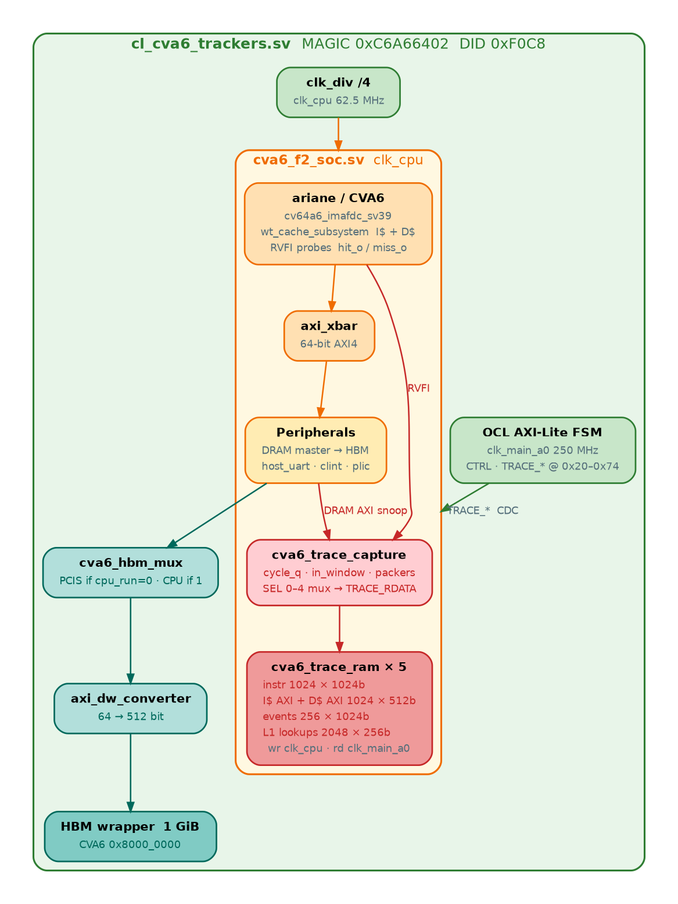

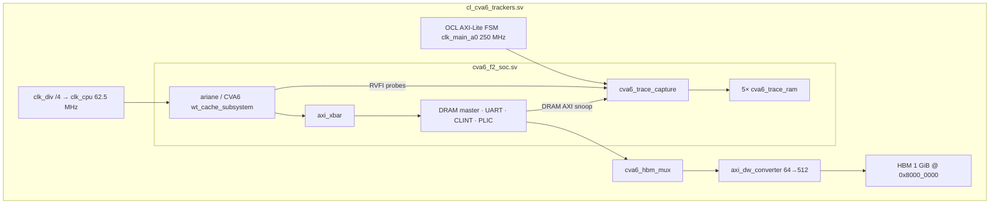

### Block diagram — host, Shell, CL

Host BAR0 programs the window and dumps BRAMs. BAR4 loads the kernel into HBM while `cpu_run=0`.

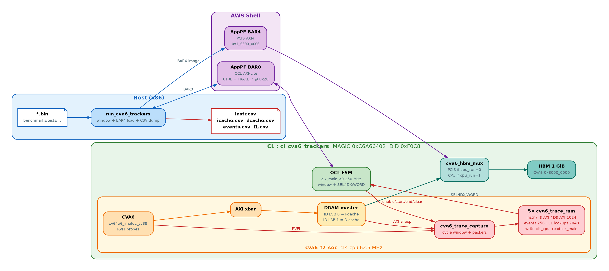

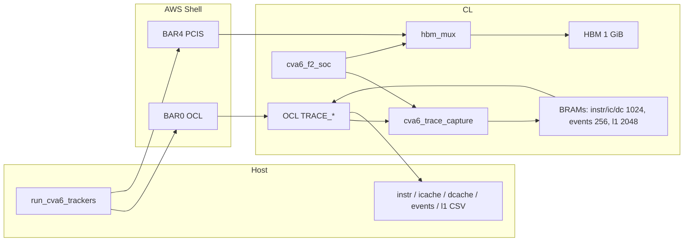

### Software flow — `run_cva6_trackers`

The window **must** be programmed before `CTRL.cpu_run=1`. The cycle counter is zero while the core is held.

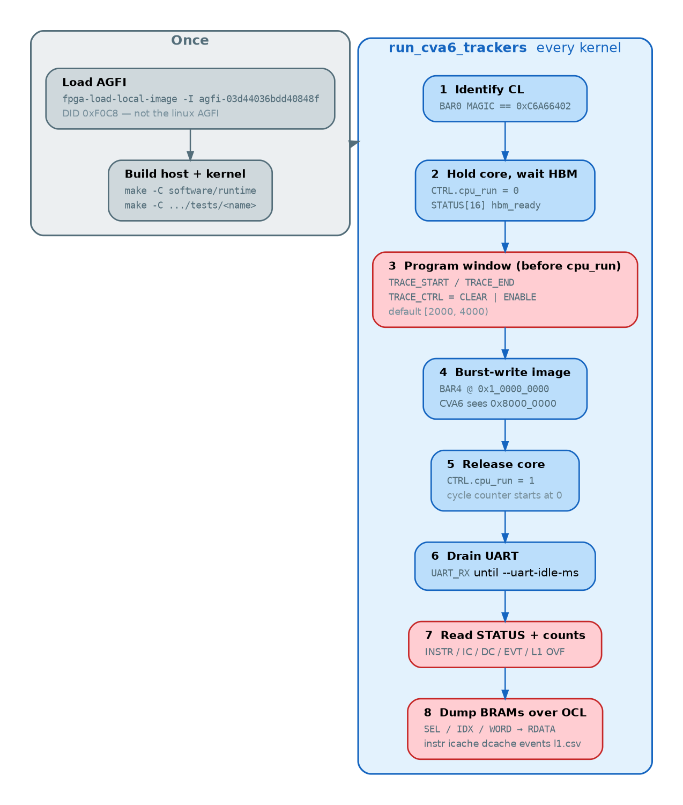

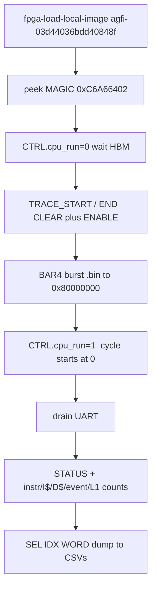

### Capture datapath — all five trackers

Writes on `clk_cpu`. Reads on `clk_main_a0` through dual-clock BRAMs. `TRACE_SEL` 0–4.

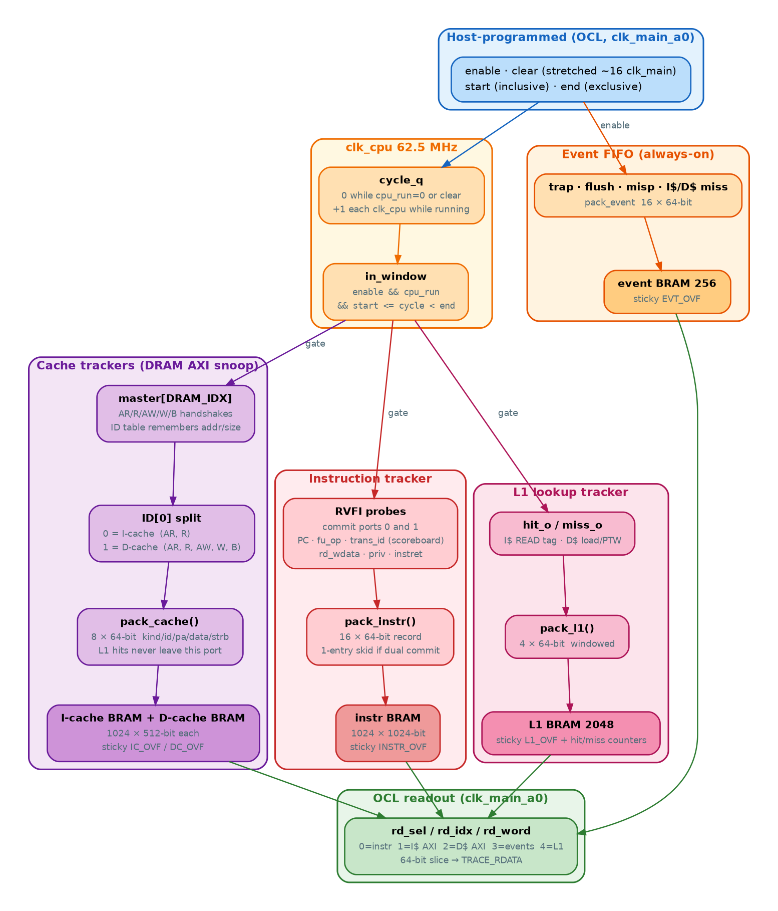

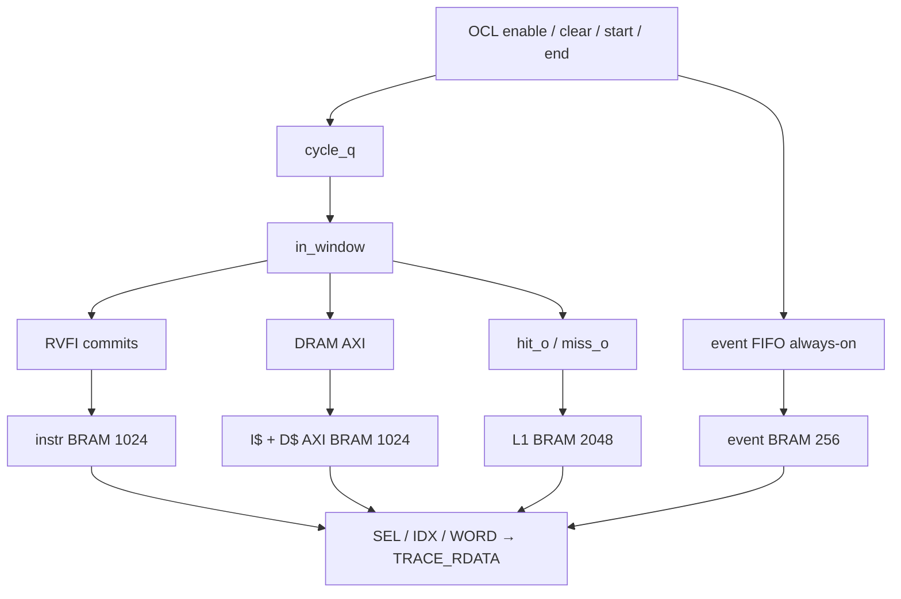

**Window.** `cycle_q` resets on `clear` or `cpu_run=0`. Capture is `[start, end)`. `STATUS[8]` is `window_done` once `cycle >= end`.

**CVA6 has no ROB.** `cv64a6_imafdc_sv39` is an 8-entry **scoreboard**. `trans_id` is the scoreboard slot (0–7). Live `lsu_ctrl` VA/PA are a snapshot of whatever the LSU is doing that cycle — they are **not** on instruction rows.

**Readout.** Host sets `TRACE_SEL`, `TRACE_IDX`, `TRACE_WORD`, then reads `TRACE_RDATA`. On an AFI without events/L1, counts at `0x60`/`0x64` read `0xDEADBEEF` and the host writes header-only CSVs.

**Loaded AFI.** Latest is `afi-0351f913d541da257` / `agfi-03d44036bdd40848f` (events + L1). The previous trackers image `agfi-07549fe796355e29f` does not have those maps.

### Instruction tracker (HW + SW)

Windowed commit stream. Dual-issue uses a 1-entry skid. Host fetches `.bin` bytes at `PC - 0x80000000`, disassembles, and replays `rd_wdata` for `rs1_val`/`rs2_val`.

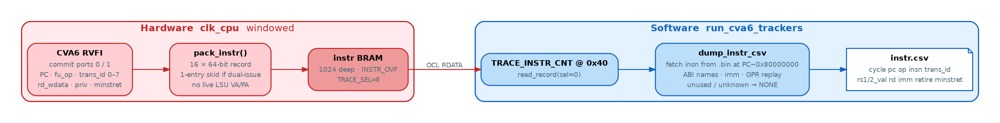

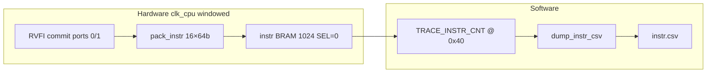

### I-cache AXI tracker (HW + SW)

DRAM-side I$ **refills only** (AXI ID LSB 0). L1 hits never appear here. Host disassembles R-beat bytes and computes AR→R latency.

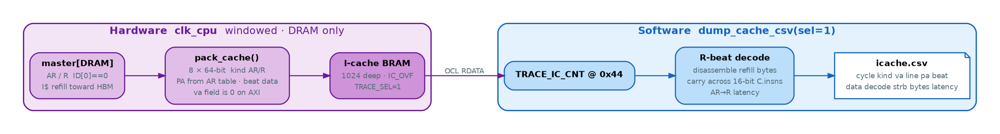

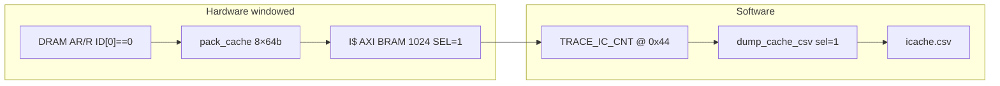

### D-cache AXI tracker (HW + SW)

DRAM-side D$ **refills** (ID LSB 1) and write-through **stores** (AW/W/B). Host prints ASCII on store beats and AR→R / AW→B latency.

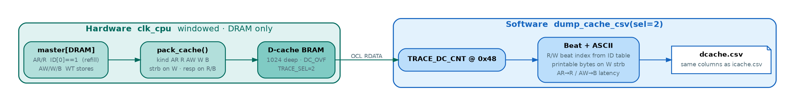

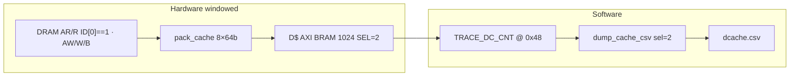

### Event FIFO tracker (HW + SW)

Always on while `TRACE_ENABLE` (not gated by the cycle window). Rising-edge trap, flush, mispredict, I$ miss, D$ miss. `--stop-on-exception` freezes the **windowed** trackers; this FIFO keeps running.

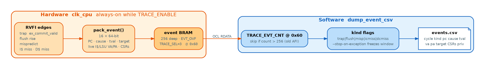

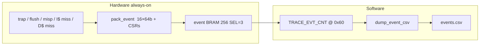

### L1 hit/miss tracker (HW + SW)

Real tag-compare `hit_o` (I$ READ; D$ load/PTW). Windowed `l1.csv` plus always-on OCL counters. D$ store hits in the write buffer are **not** counted. Misses are also copied into the event FIFO.

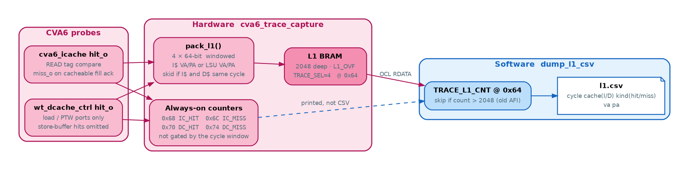

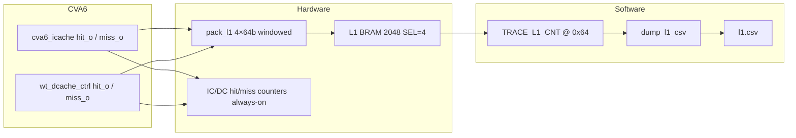

## What it captures

| File | Source | Columns |
|------|--------|---------|
| `instr.csv` | CVA6 commit / scoreboard | cycle, pc, op, insn, trans_id, rs1, rs1_val, rs2, rs2_val, rd, imm, retire, excp, cause, priv_lvl, rd_valid, rd_wdata, minstret |
| `icache.csv` | DRAM AXI ID 0 | cycle, kind (AR/R), va, line, pa, beat, data, decode, strb, bytes, resp, last, latency |
| `dcache.csv` | DRAM AXI ID 1 | same; kind is AR/R/AW/W/B |
| `events.csv` | trap / flush / mispredict / L1 miss FIFO | cycle, kind, pc, cause, tval, va, pa, target, CSRs, trans_id, rs1, priv |
| `l1.csv` | I$/D$ tag lookup (hit and miss) | cycle, cache (I/D), kind (hit/miss), va, pa |

Dropped (not CVA6, or not per-instruction): `robid`, `lqsq_id`, `coreID`, `va`/`pa` on **instr** rows, vector flags, per-instr CSR dump. Those live on `events.csv` instead.

Program the window over OCL before releasing reset, or pass `--window-start` / `--window-end` (default `2000` `4000`). Shrink the window if you need no overflow (BRAMs are 1024 records each; L1 is 2048).

## Environment

```bash
export AWS_FPGA_REPO_DIR=/projects/prj1/sle-wajahat/aws-fpga
export CVA6_REPO_DIR=/projects/prj1/sle-wajahat/cva6
export CL_DIR=$AWS_FPGA_REPO_DIR/hdk/cl/examples/cl_cva6_trackers
export AWS_DEFAULT_REGION=us-east-1
cd $AWS_FPGA_REPO_DIR
source hdk_setup.sh
source sdk_setup.sh
```

## Build AFI

```bash
cd $CL_DIR/build/scripts
./aws_build_dcp_from_cl.py -c cl_cva6_trackers --no-encrypt
```

Submit with HDK venv and `--dcp-path` (not `--cl tarball`):

```bash
source $AWS_FPGA_REPO_DIR/hdk/scripts/venv/bin/activate
export AWS_DEFAULT_REGION=us-east-1
$AWS_FPGA_REPO_DIR/hdk/scripts/create_afi.py \
  --region us-east-1 \
  --name cl_cva6_trackers \
  --description "CVA6 cycle-window instruction and cache trackers" \
  --dcp-path $CL_DIR/build/checkpoints/2026_09_02-090804.Developer_CL.tar
```

## Run a kernel and dump traces

```bash
export CL_DIR=$AWS_FPGA_REPO_DIR/hdk/cl/examples/cl_cva6_trackers
export AGFI=agfi-03d44036bdd40848f      # latest; AFI afi-0351f913d541da257
$CL_DIR/run.sh                          # loads AGFI, then bpu_1_loop_branch
$CL_DIR/run.sh bpu_1_loop_branch
WINDOW_START=2000 WINDOW_END=2500 $CL_DIR/run.sh bpu_1_loop_branch
SKIP_AGFI_LOAD=1 $CL_DIR/run.sh         # FPGA already loaded with this AGFI
```

Traces: `$CL_DIR/software/runtime/traces/<test>/instr.csv` (and `icache.csv`, `dcache.csv`, `events.csv`, `l1.csv`).

Do not use `benchmarks/tests/_run_one.sh`: it still defaults to the linux AGFI.

## OCL map (BAR0)

Same UART/CTRL/MAGIC block as `cl_cva6_linux`, then:

| Offset | Name | Meaning |
|--------|------|---------|
| `0x20` | TRACE_CTRL | `[0]` enable `[1]` clear `[2]` stop-on-exception |
| `0x24` | TRACE_STATUS | `[0]` in_window `[1:5]` instr/ic/dc/evt/l1 ovf `[8]` window_done `[9]` frozen |
| `0x28`/`0x2C` | TRACE_START | inclusive start cycle |
| `0x30`/`0x34` | TRACE_END | exclusive end cycle |
| `0x38`/`0x3C` | TRACE_CYCLE | live cycle counter |
| `0x40`/`0x44`/`0x48` | counts | instr / I-cache AXI / D-cache AXI records |
| `0x4C`/`0x50`/`0x54` | SEL / IDX / WORD | dump address (`SEL=4` L1 lookups) |
| `0x58`/`0x5C` | TRACE_RDATA | 64-bit record word |
| `0x60` | TRACE_EVT_CNT | event FIFO records |
| `0x64` | TRACE_L1_CNT | windowed L1 lookup records |
| `0x68`/`0x6C` | TRACE_IC_HIT / IC_MISS | always-on I$ counters |
| `0x70`/`0x74` | TRACE_DC_HIT / DC_MISS | always-on D$ load/PTW counters |

## Layout

```
cl_cva6_trackers/
  design/     cl_cva6_trackers.sv  cva6_f2_soc.sv  cva6_trace_*.sv
  software/   run_cva6_trackers
  docs/       RTL top, per-tracker HW+SW, block / software-flow / capture datapath
  benchmarks/ symlink → ../cl_cva6_benchmarks/benchmarks
```
